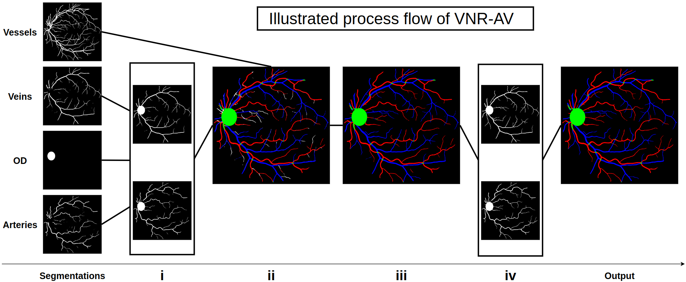
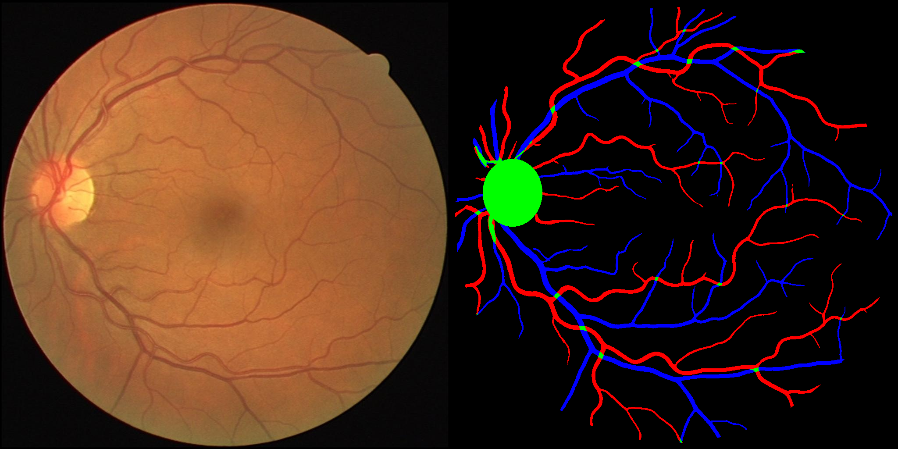
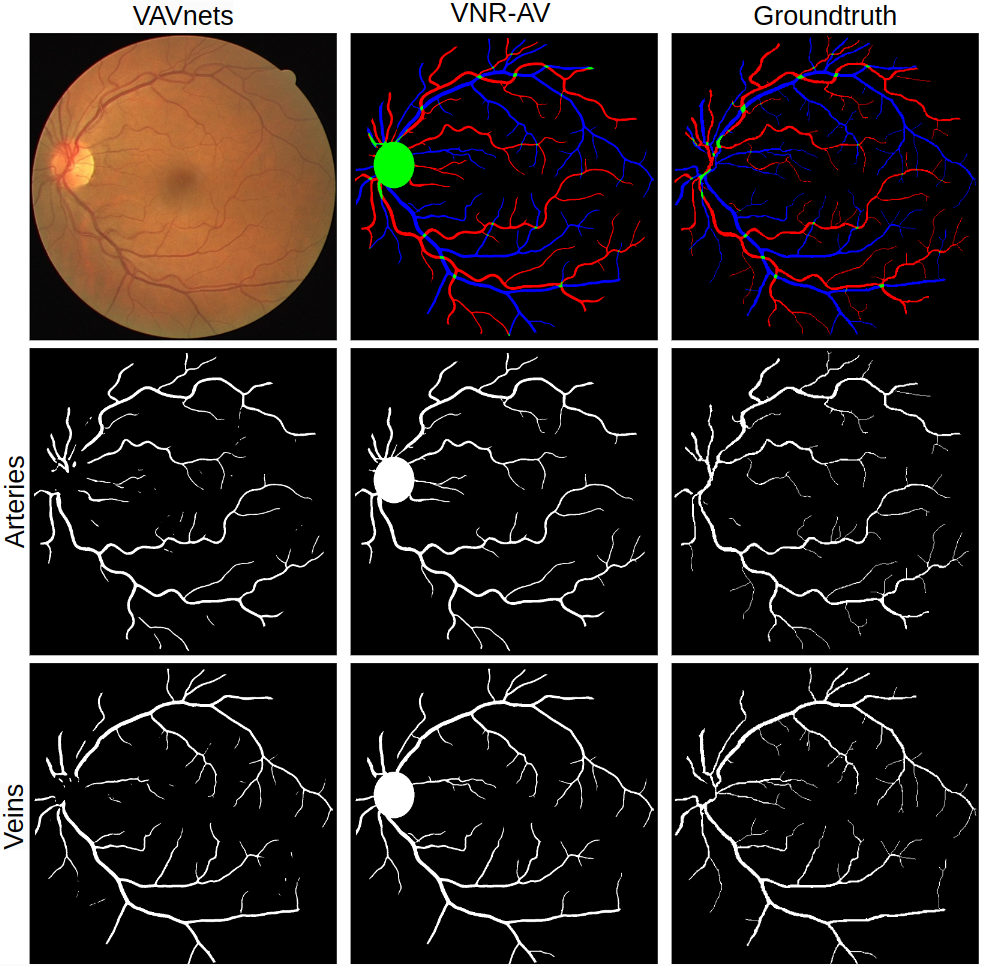

### Supplementary Material for: 
# "VNR-AV: Structural Post-processing for Retinal Arteries and Veins Segmentation"

<strong>VNR-AV</strong> (<strong>Vasculature Network Retrieval</strong> method for retinal <strong>Arteries</strong> and <strong>Veins</strong> segmentation)</strong> post-processing method achieves two main objectives: <br>
- It <strong>leverages vessels segmentation</strong> to enhance the segmentation of arteries and veins.
- It removes or reconnects segmentation components based on a set of rules developed through an <strong>understanding of deep-learning-generated segmentations</strong>

As describe in the [article](links/Article.pdf), <strong>VNR-AV</strong> comes with two main algorithms: 

---
The [Class Propagation](code/color.py) algorithm. <br>
This is a filling algorithm that <strong>leverages vessels segmentation</strong>. <br>
Constantly, vessels segmentations are more accurately predicted compared to combined arteries and veins segmentations. 
Given binary segmentations of vessels, arteries, and veins from the same fundus image, it fills the unclassified portions of the vessels
segmentations with either the arteries or veins class. <br>
The algorithm is composed of three main steps (illustrated [here](links/VNRAVsteps.png)): <strong>SOFT removal (i)</strong>, <strong>MERGE (ii)</strong> and <strong>FILL (iii)</strong>. 

---
The [Connected Components Retrieval](code/VNRAV.py) algorithm. <br>
This is an algorithm designed to remove artifacts and reconnect vasculature. <br>
Given binary segmentations of arteries and veins, enhanced by steps (i) to (iii),
it retrieves two connected trees: one of the arteries and one of the veins that can be further combined to produce the final output (illustrated [here](links/output.png)). <br>
The algorithm is composed of several steps summed-up as <strong>(iv)</strong>.

---
### Process Flow


---
As describe in the [article](links/Article.pdf), we use predictions obtained by <strong>VAVnets</strong> (repo link [here](https://github.com/idrisdulau/CIARP2024))

The complete process can be tested by using:
```bash
python3 launch.py
```

It will generate the final merged RGB segmentation (illustrated [here](links/output.png)) in a folder named: <strong>output</strong>.  <br>
All images resulting of intermediate steps are generated in a folder named: <strong>steps</strong> <br>

All the code is provided and files can also be used independantly.

---
### Fundus and final segmentation 


---
### Segmentations compared to groundtruth 
